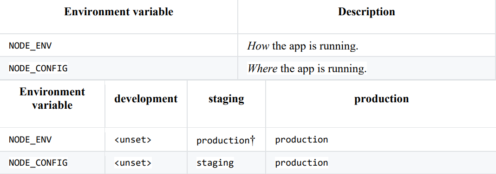

# Capstone2020 twelve factor audit

* <em>This is a work in progress. Based on</em>: https://github.com/adborden/twelve-factor-nodejs

* This app demonstrates the [twelve-factor methodology](https://12factor.net/) in react.js/node.js on the BCDevExchange.com OpenShift environment.

* The Capstone2020 PWA starter-kit solution was developed to be as near to 12-factor compliant as possible.

* The twelve-factor methodology is not specific to the MERN stack (Mongo-Express-React-Node) and most of these suggestions are general enough for any BCDevExchange OpenShift hosted application.

# The Twelve Factors

## I. Codebase 

**How we do it**

This code is tracked on GitHub. Our deployment pipeline starts with a pull request for the latest codebase. https://github.com/bcgov/CITZ-IMB-Capstone2020

## II. Dependencies
Explicitly declare and isolate dependencies.

**How we do it**

[package.json](https://docs.npmjs.com/files/package.json) declare and lock dependencies to specific versions. [npm](https://www.npmjs.com/) installs modules to a local node_modules dir so each application's dependencies are isolated from the rest of the system.

## III. Config

Store config in the environment.

**How we do it**

- The Configuration is stored in environment variables and supplied through the manifest.json file. 

- We do not make use of secrets. We are not using a back end database where the connection config would normally also be externalized from code.

- We are making use of a .env file to hold the DataBC API which could be changed out without touching the code. However, that implies the API handling code would also be generic. If the API being used is not subject to change then it would be conformant to include it in the solution code.

## IV. Backing services

Treat backing services as attached resources.

**How we do it**

- We treat the external DataBC API as a backing service referenced via an environment variable stored in our .env file containing

- REACT_APP_NEWS_API_KEY='https://news.api.gov.bc.ca/api/Posts/Latest/home/default?postKind=releases&count=50&skip=0&api-version=1.0'

- We do not use a backing database. If we had then we would connect to the database via a connection URL provided by a CAPSTONE_SERVICES environment variable.

## V. Build, release, run

Strictly separate build and run stages.

**How we do it**

- package.json allows us to configure "scripts" so that we can codify various tasks. **npm run build** is used to build this application and produces minified javascript and CSS files to be served as static assets.

- **npm start** is used to start the application.

- For details, go [here](https://github.com/bcgov/CITZ-IMB-Capstone2020/tree/master/.jenkins)

## VI. Processes

Execute the app as one or more stateless processes.

**How we do it**

- OpenShift Enterprise natively incorporates Docker containers in its deployable units. Docker containers are stateless and portable.

- If the state needs to be managed consider using Redis.

## VII. Port binding

Export services via port binding.

**How we do it**

- OpenShift assigns our application instance a port on the host machine and exposes it through the PORT environment variable

## VIII. Concurrency

Scale-out via the process model

**How we do it**

- Our app keeps no state on its own. The configuration is stored in the environment and read at startup. User sessions are stored as cookies on the client. This allows our application to scale simply by adding more processes.

-  **We would likely be running [two application instances](https://github.com/adborden/twelve-factor-node/blob/master/manifest.prod.yml#L3) on OpenShift Each application instance represents a running process of our application. The two instances are likely running on different host machines and do not need of communicating with each other. By making our processes stateless, the two application instances have no need to communicate because all state is stored in our backing service (the database in our case).**

- **Here are the steps the app takes when a request comes in:** 
**1.	A user request comes in.**  
**2.	We parse their session cookie to figure out who they are.** 
**3.	Process their request.** 

- Notice how if a user's request comes in on instance 1, the same user's second request could be **served by any instance. The steps to process subsequent requests are the same.**

- If you wanted to add some kind of session caching, that would be a job for another backing service like Memcached or Redis. That way all instances of your application could use a shared cache.

## IX. Disposability

Maximize robustness with fast startup and graceful shutdown.

**How we do it**

- **<em>Containers come and containers go. OpenShift Enterprise’s use of containers enables both fast startup and graceful shutdown</em>**

## X. Dev/prod parity

Keep development, test, and production as similar as possible

**How we do it**

- Our team development is our local laptops. The test is a  BCDevExchange OpenShift environment we use to preview the application to our partners. Production is a BCDevExchange OpenShift environment once it has been accepted by our ProductOwner/Stakeholders.

- **As much as possible, the differences between development, staging, and production is simply the configuration which is stored in the environment.**

- **Occasionally we use NODE_ENV, NODE_CONFIG to produce slightly different behavior. Specifically, anything we:**

    

- **For nodejs, NODE_ENV=production has a special meaning. npm install will only install dependencies listed in your package.json and will omit any devDependencies. We also use NODE_ENV to condition on how we build our static assets. NODE_ENV=production will include some extra optimizations.**

- **NODE_CONFIG is used sparingly, and only to load environment-specific  configuration files.**

## XI. Logs

Treat logs as event streams.

**How we do it**

- We have not implemented any event steams, we planned to use Winston as our logger. We would use logging levels to provide feedback about how the application is working. Some of this feedback could warrant bug fixes or provide analytics for feature enhancement. 

- Warnings are conditions that are unexpected and might hint that a bug exists in the code.

## XII. Admin processes

Run admin/management tasks as one-off processes.

**How we do it**

- Any one-off tasks would be added as npm scripts and located in the tasks directory. Some take inputs that can be specified when running the task npm run script -- arguments. Note that by default, we avoid writing interactive scripts. If the configuration is complex, the task can accept a configuration file or read a configuration from stdin.

 

# References

RedHat has published [this article](https://www.openshift.com/blog/optimizing-twelve-12-factor-app-for-red-hat-openshift) describing how the OpenShift platform supports the 12-factor approach.