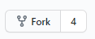
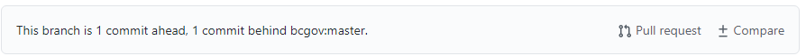
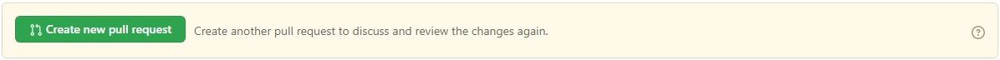
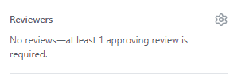
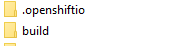
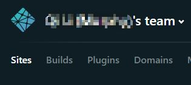
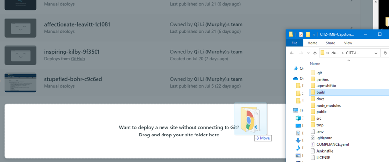
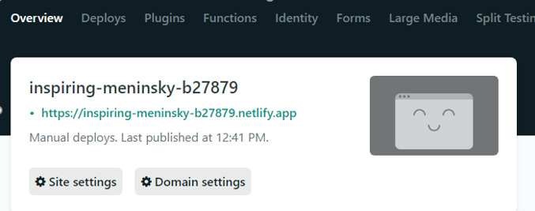

<!--
 * @Author: your name
 * @Date: 2020-07-27 23:06:35
 * @LastEditTime: 2020-07-30 11:45:10
 * @LastEditors: Please set LastEditors
 * @Description: In User Settings Edit
 * @FilePath: \undefinedc:\Users\Mark\Desktop\md\maintain.md
--> 
# Maintaining your Capstone2020 Start-Kit App


# Introduction

* In this tutorial, I'll provide you with tips and best practices to help you maintain your Capstone2020 starter-kit based solution app.

* When testing your local development, we suggest using the [Netlify](https://www.netlify.com/) as a rapid test platform once you have your solution working the way your users expect, then deploy to your intended environment (OpenShift, Azure, AWS, etc). 

* Working locally


## Steps to fork from the BCGov capstone2020 master repository to your local repository

1. Navigate into our [solution repository](https://github.com/bcgov/CITZ-IMB-Capstone2020)


2. Create a fork for the solution app by clicking the "Fork" button in the upper right corner<br />

    

3. Download the forked solution app in your local by following [build.md](./build.md)


4. (**Optional**) If you have Contributors, you must establish  the connection between your local and the master branch for the solution app.  Verify that your local repo is current with the master branch (or not), before you make a pull request. If you don't do so you might over-write the work of others.

   * Checkout your remote URL, run following command in terminal:
   ```sh
   $ git remote -v
    origin  https://github.com/${your_repo}/CITZ-IMB-Capstone2020 (fetch)
    origin  https://github.com/${your_repo}/CITZ-IMB-Capstone2020 (push)
   ```

   * Adding an upstream URL, run following command in terminal:
   ```sh
   $ git remote add upstream https://github.com/bcgov/CITZ-IMB-Capstone2020.git
   ```
   * Checkout your remote URL again, run following command in terminal:
   ```sh
   $ git remote -v
    origin  https://github.com/${your_repo}/CITZ-IMB-Capstone2020 (fetch)
    origin  https://github.com/${your_repo}/CITZ-IMB-Capstone2020 (push)
    upstream        https://github.com/bcgov/CITZ-IMB-Capstone2020.git (fetch)
    upstream        https://github.com/bcgov/CITZ-IMB-Capstone2020.git (push)
   ```
   * To upstream your local solution code, run following command in terminal:
   ```sh
   $ git pull upstream master
    remote: Enumerating objects: 1, done.
    remote: Total 1 (delta 0), reused 0 (delta 0), pack-reused 1
    Unpacking objects: 100% (1/1), done.
    From https://github.com/bcgov/CITZ-IMB-Capstone2020
    * branch            master     -> FETCH_HEAD
    * [new branch]      master     -> upstream/master
    Already up to date!
   ```
5.  Change the [version number](https://docs.npmjs.com/updating-your-published-package-version-number), run one of the following commands in terminal:
* (Commit everything before you increment the version number)
    ```sh
   $ git add .
   $ git commit -m "initial commit"
   ```
   ```sh
   $ npm version patch
   $ npm version major
   $ npm version minor
   ```
6. Add your change(s), commit your change(s), and push your change(s) to your forked repository by running:
   ```sh
   $ git add .
   $ git commit -m "initial commit"
   $ git push
   ```
## How to Make a Pull Request From Your Forked Repository to the Master Repository

1. Compared with your forked repository, if the master repository is not update-to-date, your **forked repository** will look like following here. Click "Pull Request" to create a pull request from your forked repository to master 

    <br />

2. Click create new pull request<br />

    

3. (**Until here is everything you have to do**)Add at least one reviewer<br />

    

4. Wait at least one admin reviewed your changes, until [pipeline finish deployment](./deploy.md), and finally, an admin will click the "merge" button

## How to deploy your local solution app to [Netlify](https://www.netlify.com/) for testing

NOTE: You can create a new project in Netlify directly by using the solution repo in GitHub (by using webhooks); However, GitHub may (likely) throw security notifications if your account has 2-factor authentication enabled.

### <ins>NOTICE</ins>: You can create a new project in Netlify directly use the solution repo in GitHub (by using webhooks); However, GitHub will keep throwing some security notification if your account has 2-factor authentication

1. Navigate to [Netlify](https://www.netlify.com/)

2. Login with Github/ GitLab/ Bitbucket/ Email

3. Assume your solution code works fine locally <br/>
   Testing by run following command in terminal:
   ```sh
   $ npm start
   ```

4. Run following command in your solution root folder ( the folder has package.json ). This command will generate a ./build folder under the root folder. The build folder has everything for deploying the product.
   ```sh
   $ npm run build
    > capstone2020@0.10.1 build E:\demo\CITZ-IMB-Capstone2020
    > react-scripts build

    Creating an optimized production build...
    Compiled successfully.

    File sizes after gzip:

    87.44 KB  build\static\js\2.31a99ac9.chunk.js
    22.47 KB  build\static\css\2.af3c1da9.chunk.css
    5.33 KB   build\static\js\main.414fb813.chunk.js
    850 B     build\static\css\main.aab31845.chunk.css
    777 B     build\static\js\runtime-main.9d16b1e1.js

    The project was built assuming it is hosted at /.
    You can control this with the homepage field in your package.json.

    The build folder is ready to be deployed.
    You may serve it with a static server:

    serve -s build

    Find out more about deployment here:

    bit.ly/CRA-deploy

   ```
   <br/>

   

5. Click “Sites” in Netlify.

    

6. Drag ./build folder into the bottom of the “Sites” page. Netlify will automatically navigate to the project overview page after drag action.<br/>

    

7. The overview page will pop-up after deployment. Open the solution app by clicking the URL under the overview page.

    

# Debuging Tips:

As an experienced developer you will have your established approach to debugging often based on the tools you use. With the ever changing libraries and patterns keeping up with community best practices , using forums such as stackoverflow can help maintain your development and defect remediation velocity.

Here are a few useful articles we recommend

* https://medium.com/@baphemot/intro-to-debugging-reactjs-applications-67cf7a50b3dd
 
* https://raygun.com/blog/react-debugging-guide/
 
* https://blog.logrocket.com/debug-react-applications-with-the-new-react-devtools/

# Summary:

In this tutorial, we have shown you how to create a local repository, make your changes, and push to the Netlify environment before publishing to your intended deployment environment.

**<em>Remember to bump up your build version before deploying your code.</em>**
